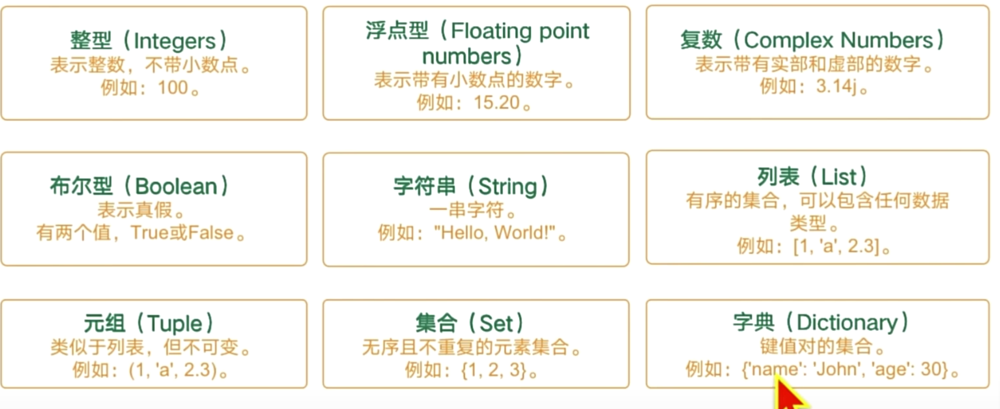
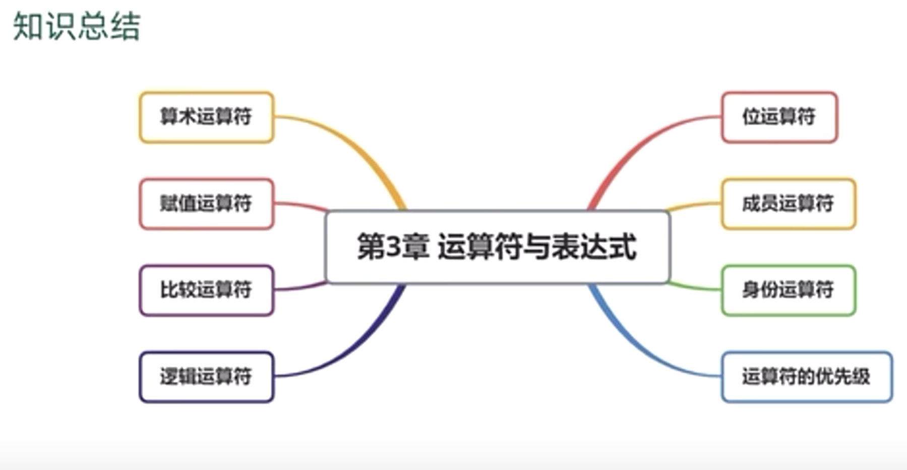
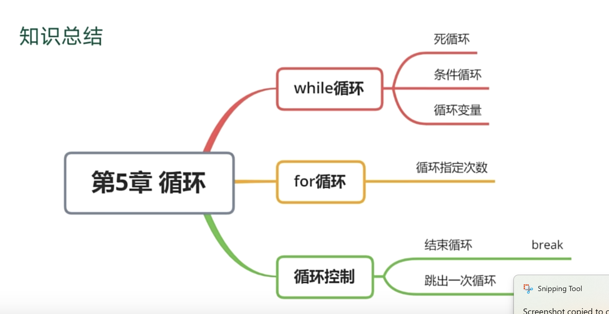

# study-python
study-python

# 目录
- [第一个程序](#第一个程序)
- [变量](#变量)
- [运算符](#运算符)
- [条件判断](#条件判断)
- [循环](#循环)
- [组合数据类型](#组合数据类型)

# 简介
章节：


# 第一个程序
```python
# 打印数字
print(2024)

# 打印字符串
print("hello world")

print(333)
```
## 注释
```python
# 块注释
# 我是块注释
print(111)

# 行内注释
print(222) #我是块注释

# 多行注释
'''
我是多行注释
'''
print(333)
```

## 打印变量
```python
# 任务3：创建变量year值为2024
year = 2024
print(year)
```

## 一行打印多个内容
```python
print("我是main")
year = 2024
# sep，分隔符，设置打印多个内容的分隔符，默认值是一个空格
print(year, "年，我要减肥", sep="")
print(year, "年，我要旅游", sep="")
print(year, "年，我要学习", sep="")
# end，打印完后，自动追加的内容，默认是\n换行
print(end="*")
```

## 格式化输出
```python
month = 2
day = 20
week = "一"
weather = "晴"
temp = 19.5
year = 2025

# %d整形，%s字符型，%f浮点型
# %2d表示占2位， %02d表示占2位，不够使用0填充
# %.2f 表示小数点2位
print("今天是%d年%02d月%d日，星期%s, 天气%s，温度%.2f" % (year, month, day, week, weather, temp))
```

## input的使用
```python
month = 2
day = 20
week = "一"
weather = "晴"
temp = 19.5
year = 2025

# %d整形，%s字符型，%f浮点型
# %2d表示占2位， %02d表示占2位，不够使用0填充
# %.2f 表示小数点2位
print("今天是%d年%02d月%d日，星期%s, 天气%s，温度%.2f" % (year, month, day, week, weather, temp))
```

## 流程图


## 章末总结


# 变量
## 变量的创建
创建单个，多个变量


```pycon
# 任务：买苹果
price = 10.5
weight = 7.5
money = price * weight
print("总共消费了%.2f" % money)
```
## 变量的修改
```python
# year = 2023
# print(year)
# year = 2024
# print(year)
#
# # 正确执行,不同类型的变量可以相互赋值
# money = '10元'
# money = 10
# print(money)

# 超市打折活动
price = 10.5
weight = 7.5
money = price * weight
money = money - 5
print("总共消费了%.2f" % money)
```

## 变量的命名
python使用大写表示常量

- 见名知义
- 不能使用关键字
- 不能使用数字开头
- 驼峰命名法

## 变量的类型
```python
a = 'afd'
print(type(a))
print(isinstance(a, str))
print(isinstance(a, int))
print(isinstance(a, float))
```


## 整数
```python
# 整数变量的定义
num = 10
print(num)

# 负数
num2 = -10
print(num2)

# 查看变量的数据类型
print(type(num2))

# 输入数字的计算
num3 = input("请输入一个数字:")
print(type(num3))
num3 = int(num3) + 10
print(num3)
```

## 浮点数
```python
# 浮点数的计算
n1 = 0.1
n2 = 0.2
# 计算精度有误差
print(n1 + n2)

# 四舍五入函数：round
n3 = round(n1 + n2, 2)
print(n3)

import math
n1 = 2.1
n2 = 15.256
# 向上取整： ceil
n4 = math.ceil(n1 + n2)
print(n4)
# 向下取整: floor
n5 = math.floor(n1 + n2)
print(n5)
```

## 布尔型

```python
a = True
b = False
print(a, b)
```

## 字符串
```python
# 创建字符串
s1 = 'hello'
print(s1)
s2 = "hello"
print(s2)
# 3引号创建字符串
s3 = '''2024
hello
world'''
print(s3)

s4  = "it's a hat"
print(s4)
# 使用转义字符\
s5 = '123\'4\"567'
print(s5)

# 字符串拼接
print('字符串拼接-----------')
print(s1 + s2)
n = 5
# print(s1 + n) # 字符串和数字不能直接相加

# 字符串乘法
print('*' * 10)
print(10 * 'happy')

```

## 字符串索引
```python
# 创建字符串
s = "hello world"
print(s[0])
print(s[4])
print(s[-1])
# 切片写法，包含起始索引，不包含结束索引
print(s[0:4])
print(s[6:9])
# 跳着取
s2 = "123456789"
print(s[0:9:2])

# 字符串反转
print(s2[-1:-10:-1])
print(s2[::-1])

```
 切片写法


## 类型转换
```python
# 转换为整数int
s = '2024'
print(s)
# 纯数字的才可以转换
n = int(s)
print(n)
print(type(s), type(n))
s1 = 2.23
print(int(s1))
s2, s3 = True, False
print(int(s2), int(s3))
# 转换为浮点数float
s = '123'
print(float(s))
n = 2024
print(float(n))

# 转换为布尔值bool
# 转换为字符串str

```

## 小整数地址问题
python对于-5-256之间的整数，会缓存起来，不会重复创建  
对于这些数的引用，会指向同一个地址
```python
a = 5
c = 5
print(id(a), id(c))
```

## 章末总结


# 运算符


## 算术运算符

```python
print(4+1)
a= 10
b= 3
print(a+b)
print(a-b)
print(a*b)
print(a/b)
print(a%b) # 取余数，求模
print(a**b) # 幂运算，a的b次方
print(3 + 2 * 4 ** 2) # 优先级，先算幂运算，再算乘法，最后算加法
```

## 赋值运算符
```python
a = 2
print(a)
a += 2
print(a)
a = a + 2
print(a)
```


## 比较运算符

```python
print(3 != 3)
print(3 == 2)
print(3 >= 2)
print(3 <= 2)
print(3.0 == 3)
print('hello' > 'hell')
print('he' > 'hw') # 比较的是ASCII码值
print(ord('a'), ord('z'))
```

## 逻辑运算符
```python
# and
print(True and False)
print(True and True)
print(True and False and True)
print(1==1 and True and 2<3)
# ’‘是False，其他有值的字符串是True
# and 会返回第一个为False的值，如果都为True，返回最后一个值
# or 会返回第一个为True的值，如果都为False，返回最后一个值
# 这里适用与一些兜底数据，默认值
print('hello' and 'hi')
print('' and 'hi')
print(0 and 'hi')

# or
print(True or False)
print(2024 or 2025)
print(0 or '888')

# not
print(not True)
print(not 1)
print(not 'hello')

# 优先级 not > and > or
print(True and not False)
```


## 位运算符


## 成员运算符


## 章末总结


# 条件判断


# 单分支
```python
weather = '下雨'
if weather == '下雨':
    print('带伞出门') # if语句的下级代码

if False:
    print('111')

# 判断年龄是否大于等于18
age = 19
if age >= 18:
    print('可以去网吧')
    print('hello')
```


## 双分支
```python
weather = "下雨"
if weather == "下雨":
    print('带雨伞')
else:
    print("戴帽子")

# 判断年龄
age = int(input("请输入你的年龄："))
if age >= 18:
    print("可以去网吧")
else:
    print("不能去网吧")
```

## 多分支
```python
score = 98

if score >= 98:
    print("A")
elif score >80 and score <90:
    print("B")
elif score >70 and score < 80:
    print("C")
else:
    print("D")

# bmi计算
w = float(input("请输入你的体重，单位KG："))
h = float(input("请输入你的身高，单位M："))
bmi = w / (h * h)
print(bmi)
if bmi < 18.5:
    print("偏瘦")
elif 18.5 <= bmi < 25:
    print("正常")
elif 25 <= bmi < 30:
    print("偏胖")
else:
    print("肥胖")
```
## 嵌套分支
不推荐使用，可读性差

## match语句
python3.10新增的语法
```python
x = 4
match x:
    case 1:
        print("111")
    case 2:
        print("222")
    case 3:
        print("333")
    case 4:
        print("444")
```

## 章末总结


## 本章练习
```python
age = input("请输入你的年龄：")
if age.isdigit():
    age = int(age)
    if 0 <= age <= 120:
        print("输入正确")
    else:
        print("输入错误")
```

# 循环

## while循环

```python
# 初始条件
n = 0
while n < 5:
    print("-" * 10)
    n += 1
    print(n)

# 求和 1 + 2 + 3 + ... + 100
n = 1
result = 0
while n <= 100:
    result += n
    n += 1
print(result)
```

## for循环
```python
for i in range(10):
    print(i)

print(list(range(10)))

result = 0
for i in range(1, 101):
    result += i
print(result)

# 1! + 2! + 3!.... + n!
def fib(n):
    if n <= 1:
        return 1
    result = 1
    for i in range(1, n + 1):
        result *= i
        i += 1
    return result

def fib_sum(n):
    if n <= 1:
        return 1
    result = 0
    for i in range(1, n + 1):
        result += fib(i)
        i += 1
    return result
print(fib(3))
print(fib_sum(3))
```

## break和continue
```python
while True:
    print("-" * 10)
    break

while True:
    name = input("请输入你的名字：")
    if name == "lb":
        print("欢迎回家")
        break
    else:
        print("不在家")

for i in range(10):
    if i > 0 and i % 3 == 0:
        print(i)
        break

# 判断一个数是否为质数
def is_prime(n):
    if n <= 1:
        return False
    for i in range(2, n):
        if n % i == 0:
            return False
        i += 1
    return True

print("2是不是质数:", is_prime(2))
print("3是不是质数:", is_prime(3))
print("4是不是质数:", is_prime(4))
print("5是不是质数:", is_prime(5))
print("10是不是质数:", is_prime(10))

# 跳过当此循环
for i in  range(5):
    if i == 2:
        continue
    print(i)
```

## 指数爆炸
```python
# 纸的厚度
n = 0.1
w = n
for i in range(50):
    w *= 2
    print(w)

# 国王熟麦粒
# 1-1 2-2 3-4 4-8..
g = 1 # 当前格子的麦粒数
total = 0 # 麦粒总数
a = 1 # 当前格子的序号
while a <= 100:
    total += g
    g *= 2
    a += 1
    print(total)

# 人生复利公式
```

## 本章总结



# 组合数据类型

## 序列
```python
# 列表创建
# 列表创建
# 列表创建
list1 = []
print(list1)
print(type(list1))
list2 = [1, 2, 3, True, 'hello']
print(list2)
list3 = list("12345678")
print(list3)
# 列表的索引
print(list3[1])
# 列表的切片, 从下标为2的元素开始，到下标为6的元素结束，步长为2
print(list3[2:6:2])
# 列表的乘法和加法
print(list3 + list2)
print(list3 * 3)
# 列表的成员运算
print('1' in list3)
print('1,2,3' in list3)
# 列表的函数
print(len(list3))
print(max(list3))
print(min(list3))
# del list3


print('-' * 20)

# 列表的遍历
for i in list2:
    print(i)
for i,j in enumerate(list2):
    print(i,j)
for i in range(len(list2)):
    print(i, list2[i])

# 列表的常用方法
# 添加元素
list3.append('666')
print(list3)
list3.extend(list2)
print(list3)
list3.insert(1,'777')
print(list3)
# 根据索引删除元素
list3.pop(1)
print(list3)
list3.remove('666')
print(list3)
# 清空列表
list.clear(list2)

# 计算若干个人的平均年龄
age = [10, 20, 30, 40, 23, 45]
print(sum(age) / len(age))
```


## 元组
```python
tuple1 = (1, 2, 3, True, 'hello')
print(tuple1)
print(type(tuple1))
# 如果元组只有一个元素，需要在元素后面添加逗号，否则会被认为是小括号计算
tuple2 = (1,)
print(tuple2)
tuple3 = tuple()
print(type(tuple3))
```


## range函数
```python
print(list(range(10)))
print(list(range(2,10)))
print(list(range(2,10,3)))

# 高斯求和
total = 0
for i in range(10):
    total += i
print(total)

# 水仙花数，每数字的立方和等于这个数本身
for i in range(100, 1000):
    # a = i // 100
    # b = (i % 100) // 10
    # c = i % 10
    t = str(i) # 将int转换为str，123 -> "123"
    a = int(t[0])
    b = int(t[1])
    c = int(t[2])
    if a ** 3 + b ** 3 + c ** 3 == i:
        print(i)
```


## 字符串
```python
s1 = 'hello world'

# 序列的通用操作
print(s1 + ' mia')
print(s1*3)
print(len(s1))
print('h' in s1)
# 遍历
for i in s1:
    print(i)
for index, value in enumerate(s1):
    print(index, value)
# 类型转换
print(list(s1))
print(tuple(s1))
print(set(s1))
# 字符串函数
# print(s1.strip())
print(s1.split(" "))
print("#".join(s1))
```


## 字典

```python
# 字典的创建
d = {
    "name" : "lb",
    "gender" : True,
    "name" : 'lb2' # 建重复的话，会覆盖之前的值
}
print(d)
print(type(d))
# 新增键值对
d['height'] = 170
print(d)
# 获取键值对
name = d['name']
print(name)
# 修改键值对
d['height'] = 173
# 字典的遍历
for k, v in d.items():
    print(k, v)
for k in d.keys():
    print(k)
for v in d.values():
    print(v)
# 字典的常用方法
d.pop('name')
print(d)
```

## 集合

```python
s1 = set()
s = {1,2,3,4,5,1,2}
print(s)
print(type(s))
s = set([1,2,3,4,5])
print(s)
s = set("1223")
print(s)
```